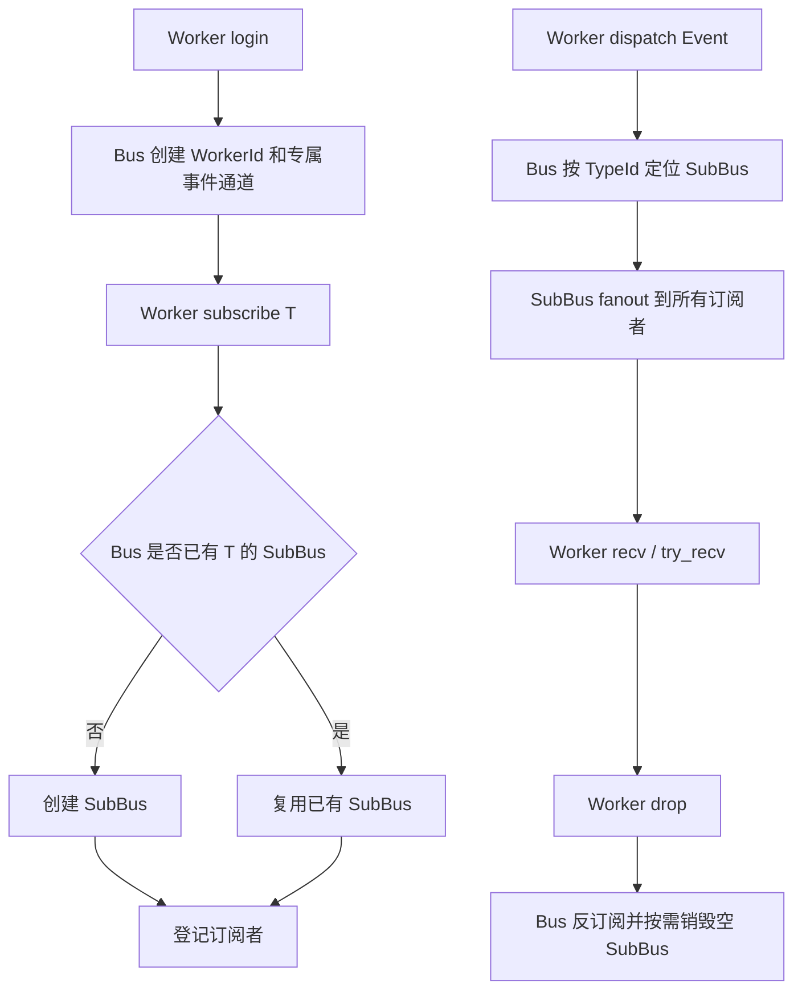
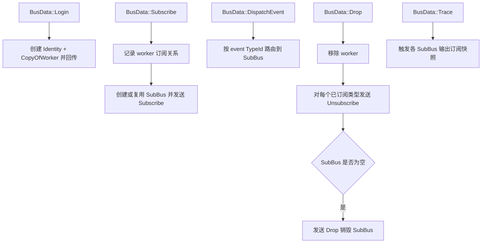

# EventBus

一个基于 `tokio::mpsc` 的轻量异步事件总线，支持：
- 多 Worker 登录
- 按事件类型订阅
- 广播分发给同类型的所有订阅者
- 通过 `derive` 简化 `Event / Worker / Merge` 实现

## Workspace 结构

- `for-event-bus`: 运行时总线实现（Bus、SubBus、Identity）
- `for-event-bus-derive`: 过程宏（`#[derive(Event, Worker, Merge)]`）

## 核心组件

- `Bus`: 控制平面，处理登录、订阅、投递、下线清理
- `SubBus`: 数据平面，每个 `TypeId` 一个子总线，负责 fanout
- `IdentityOfRx / IdentityOfSimple / IdentityOfMerge`: Worker 侧 API

## 总体流程图

## Bus 事件循环（控制平面）

## 行为语义（重要）

- 顺序保证：
  - 对于同一个订阅者，事件入其接收队列的顺序与该订阅者在同一 `SubBus` 中被 fanout 的顺序一致。
  - 不同订阅者之间不保证“同时到达”或全局一致时序。
- 背压与丢消息：
  - `SubBus -> 订阅者` 使用 `try_send`。
  - 当订阅者队列满时，本次事件会被丢弃，并记录 `warn` 日志（当前策略是“丢该订阅者本次消息”）。
- Drop/清理语义：
  - 控制平面（`BusData`）使用 `unbounded_channel`，`Identity` 在 `Drop` 中发送下线通知不会因容量满而失败。
  - Bus 收到下线后会执行退订；若某事件类型订阅者归零，会销毁对应 `SubBus`。
- 类型转换语义：
  - 事件内部统一保存为 `Arc<dyn Any + Send + Sync>`，不再使用 `unsafe transmute`。
  - 下转失败时返回 `BusError::DowncastFailed { expected, actual }`，便于定位类型不匹配。

## Merge derive 约束

`#[derive(Merge)]` 仅支持 enum，且每个 variant 必须满足：

- tuple 风格
- 恰好 1 个字段
- 字段类型是具体类型路径（如 `module::CloseEvent`）
- 所有 variant 的字段类型不能重复

不满足时会在编译期报错（`compile_error!`），而不是运行时再暴露问题。
