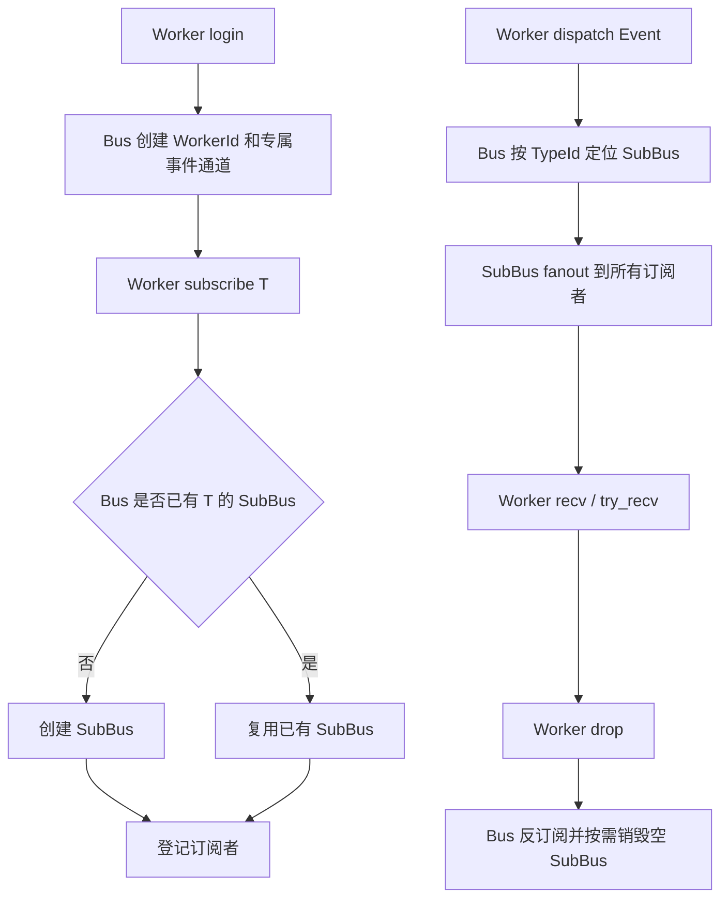
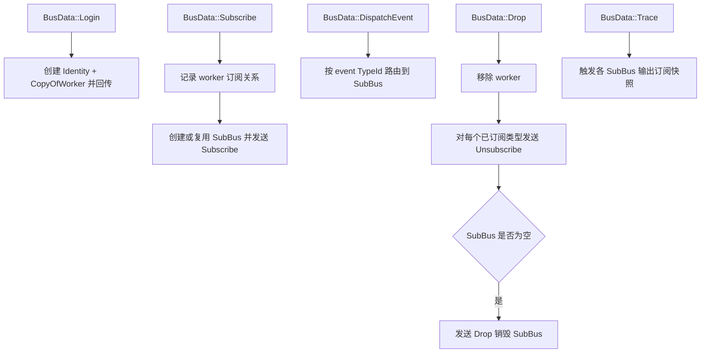

# EventBus

一个基于 `tokio::mpsc` 的轻量异步事件总线，支持：
- 多 Worker 登录
- 按事件类型订阅
- 广播分发给同类型的所有订阅者
- 通过 `derive` 简化 `Event / Worker / Merge` 实现

## Workspace 结构

- `for-event-bus`: 运行时总线实现（Bus、SubBus、Identity）
- `for-event-bus-derive`: 过程宏（`#[derive(Event, Worker, Merge)]`）

## 核心组件

- `Bus`: 控制平面，处理登录、订阅、投递、下线清理
- `SubBus`: 数据平面，每个 `TypeId` 一个子总线，负责 fanout
- `IdentityOfRx / IdentityOfSimple / IdentityOfMerge`: Worker 侧 API

## 总体流程图

## Bus 事件循环（控制平面）

